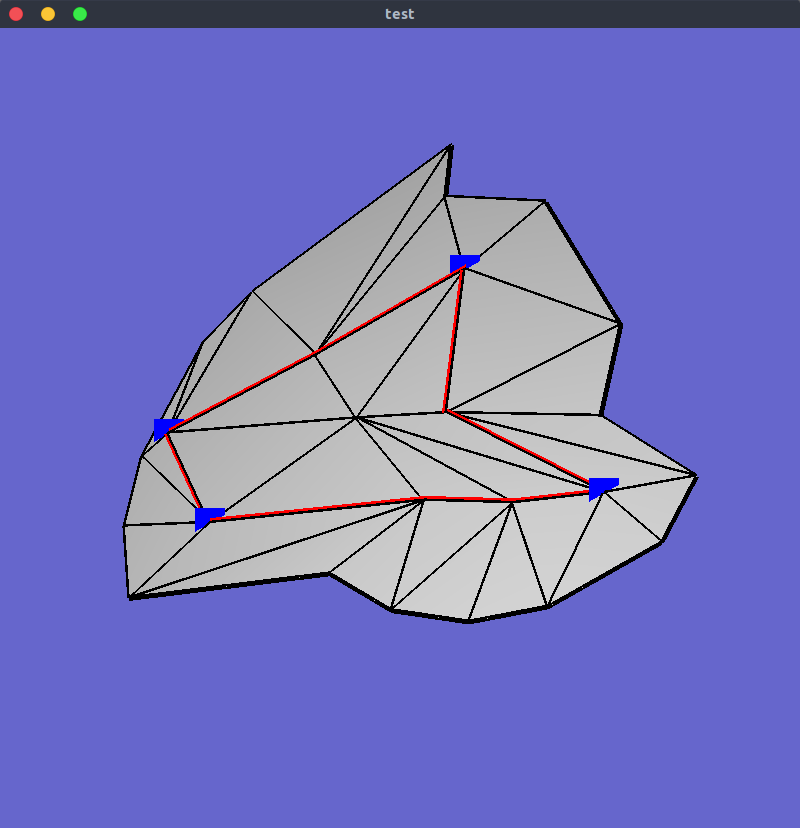

# find_mesh_shortest_path
指定した頂点間の最短経路(三角形の辺を通る経路)を求めるコード．  

最短経路を示す頂点のインデックス(.txt)と，最短経路で囲まれた領域でオブジェクトをカットしたもの(.obj)が保存される．

## How to run

`python3 main.py argvs[1] argvs[2]`  
`argvs[1] --> 最短経路を求めたい.objファイルへのパス`  
`argvs[2] --> 求めたい頂点のインデックスが書かれた.txtファイルへのパス`  

## Example

`python main.py ./test/test.obj ./test/test_fp.txt`  

`./test_fp/inside.obj`  
`./test_fp/shortest-path.txtが保存される`  
